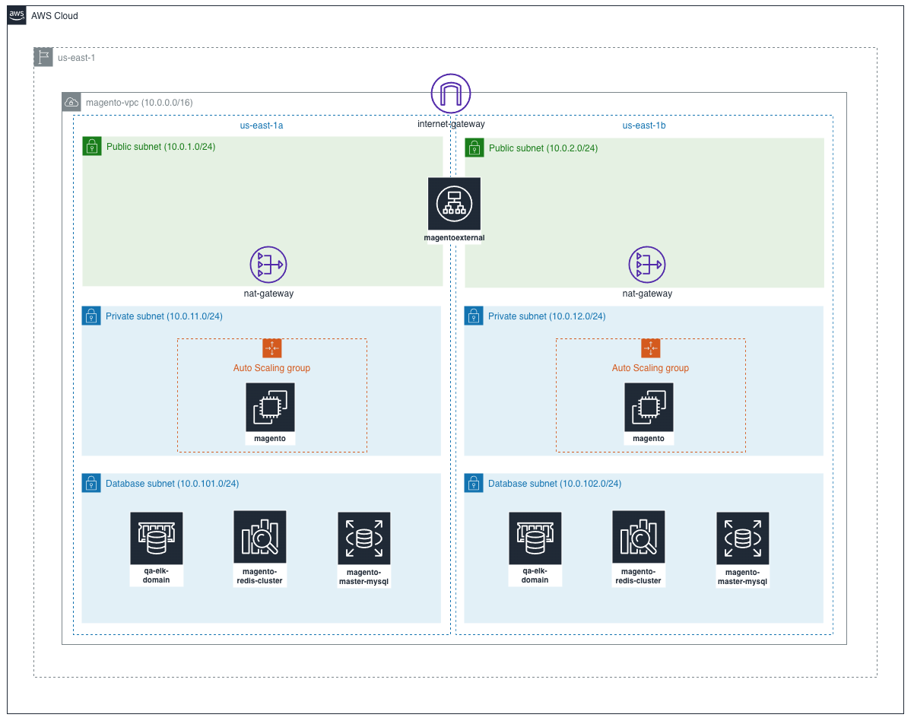

ifdef::env-github[]
:tip-caption: :bulb:
:note-caption: :information_source:
:important-caption: :heavy_exclamation_mark:
:caution-caption: :fire:
:warning-caption: :warning:
endif::[]

= Provisioning a high available Magento installation

== About

This Terraform project creates all the necesary resources to create a Magento instance based on the official AWS reference and minor updates to the infrastructure to support true HA and ElasticSearch for the latest Magento version

NOTE: This project a combination of manual and automated steps, this guide will the process from scratch.

== Setup from scratch

There is an order in which the scripts need to be ran in order to make it work. 

=== Create a pem file

====
In order to interact with EC2 later let's create a pem file.

**Comment the file** `main.tf` after line 31. The only module executable should be the `pem` module

[source,hcl]
----
module "pem" {
  source           = "./modules/pem"
}
----

Now, let's execute the `pem` module

[source,bash]
----
cd qa/6_magento
terraform init # this coommand is needed everytime we add a module to the stack
terraform plan
terraform apply
----

You should have now a key file created under ./modules/pem/magento_master_private_key.pem. We will use it later.

====

=== Create the networking resources

====
Let's create the VPC and its internal components as base for the persistence and compute resources.

Uncomment the file from line 35 to line 43, and keep the previous lines.

[source,hcl]
----
module "network" {
  source           = "./modules/network/"
  app_name         = var.app_name
  azs              = var.azs
  environment      = var.environment
  database_subnets = var.database_subnets
  public_subnets   = var.public_subnets
  private_subnets   = var.private_subnets
}
----

Now, let's execute the `network` module

[source,bash]
----
cd qa/6_magento
terraform init # this coommand is needed everytime we add a module to the stack
terraform plan
terraform apply
----
====

=== Create the persistence resources

====
Let's create the RDS, Elasticache and ElasticSearch resources to we can install Magento.

Uncomment the file from line 48 to line 77, and keep the previous lines .

[source,hcl]
----
module "database" {
  source           = "./modules/database/"
  environment      = var.environment
  vpc_id           = module.network.vpc_id
  db_subnet_group  = module.network.db_subnet_group_name
}

module "efs" {
  source           = "./modules/efs/"
  app_name         = var.app_name
  vpc_id           = module.network.vpc_id
  public_subnets   = module.network.public_subnets
  environment      = var.environment
}

module "elasticsearch" {
  source                      = "./modules/elasticsearch"
  region                      = var.region
  vpc_id                      = module.network.vpc_id
  environment                 = var.environment
  subnet_ids                  = module.network.database_subnets
  account_id                  = data.aws_caller_identity.current.account_id
}

module "redis" {
  source                      = "./modules/redis"
  vpc_id                      = module.network.vpc_id
  subnet_ids                  = module.network.database_subnets
  environment                 = var.environment
}
----

Now, let's execute the `database`, `elasticsearch`, `efs` and `redis` modules.

[source,bash]
----
cd qa/6_magento
aws iam create-service-linked-role --aws-service-name es.amazonaws.com # ElasticSearch needs this role in the account to proceed
terraform init
terraform plan
terraform apply
----

====

=== Create the master image

====

Uncomment the file from line 80 to line 86, and keep the previous lines .

[source,hcl]
----
module "master_instance" {
  source           = "./modules/master_instance/"
  environment      = var.environment
  key_name         = module.pem.pem_file_name
  subnet_id        = element(module.network.public_subnets, 0)
  vpc_id           = module.network.vpc_id
}
----

Now, let's execute the `master_instance` module

[source,bash]
----
cd qa/6_magento
terraform init 
terraform plan
terraform apply
----

====

=== Install Magento in the master image pointing to the services just created

Until this point, we have everything we need to create a single image with all the components needed to install Magento, now let's configure the master image.

==== Connect to the master image

[source,bash]
----
ssh -i "./modules/pem/magento_master_private_key.pem" ubuntu@34.203.42.18 #replace the IP you get for the master image
----

==== Enable a basic firewall

You must create a rule that allows SSH connections to your server. This is the connection we are currently using
[source,bash]
----
sudo ufw allow ssh
----

With the new rule created, turn on the firewall
[source,bash]
----
sudo ufw enable
----

==== Convert to a web server for Magento 2.4

===== Updating repositories

You’ll first start by updating your servers repositories. This tells Ubuntu what is available to download when we ask it to install something. Kind of like refreshing the App Store on your phone.

We need to tell Ubuntu to update it’s records from all of the connected repositories. 

[source,bash]
----
sudo apt update
----

===== Install Apache and configure it specifically for Magento 2.4

Now we’re ready to install and configure Apache. Apache is the software that will ultimately convert our basic server into a web server.

===== Install Apache
With the repositories updated, install Apache using:
[source,bash]
----
sudo apt install apache2 -y
----

Open an Apache config file to allow .htaccess files in the web directory: 
[source,bash]
----
sudo nano /etc/apache2/sites-available/000-default.conf
----

Add the below to the file, then save and exit

[source]
----
<Directory "/var/www/html">
    AllowOverride All
</Directory>
----

Open an Apache config file to set the Global ServerName
[source, bash]
----
sudo nano /etc/apache2/apache2.conf
----

Add this line at the end of the file, then save and exit (domain.com represents your server IP):
[source]
----
ServerName domain.com
----

Check for any syntax errors we may have introduced
[source, bash]
----
sudo apache2ctl configtest
----

Enable Apache rewrite (this resolves most post-installation 404 errors)
[source, bash]
----
sudo a2enmod rewrite
----

Restart Apache for any changes to take effect
[source, bash]
----
sudo systemctl restart apache2
----

Enable Apache through the firewall that we enabled earlier
[source, bash]
----
sudo ufw allow 'Apache Full'
----

===== Test Apache

To test that Apache is working, simply visit the IP address of your server.

===== Install PHP and any extensions specifically for Magento 2.4

Now, we need to install PHP. PHP is a scripting language which allows web applications like Magento to supercharge normal HTML pages. It’s a bit more complicated than that, but needless to say it’s a requirement for Magento.

Let’s start by installing PHP and all of the PHP extensions required in order for Magento 2.4 to run

[source, bash]
----
sudo apt install php7.4 libapache2-mod-php7.4 php7.4-mysql php7.4-soap php7.4-bcmath php7.4-xml php7.4-mbstring php7.4-gd php7.4-common php7.4-cli php7.4-curl php7.4-intl php7.4-zip zip unzip -y
----

Tell the web server to prefer PHP files (move index.php to front of the list) 
[source, bash]
----
sudo nano /etc/apache2/mods-enabled/dir.conf
----

You now need to replace 2 default variables in the PHP configuration. Do this by editing the php.ini file!
[source, bash]
----
sudo nano /etc/php/7.4/apache2/php.ini
----

TIP: Tip: Press `Ctrl+W` to load Search Box in nano text editor

Use your Arrow or Page Up/Down keys to work your way down the file and find `date.timezone =`. You’ll need to add your server’s time zone. Use the Supported List 183 linked in the article for your setup. In our case, it would be America/Mexico_City.

Then, find `memory_limit` and replace `128M` with an appropriate value. Because this is a 2GB Server, let's set this to `2G`.

Now save your changes by press `Ctrl+X` to exit, `Y` to save and Enter to confirm.

Restart apache for changes to take effect
[source, bash]
----
sudo systemctl restart apache2
----

===== Enable SMTP Capability

This next step is somewhat controversial as it is only required to send your 2FA email during the installation of Magento 2.4.0. Therefore, we’ll only be doing the bare-minimum to get it working.

====== Install Postfix (I left all options as default values)

Postfix is a mail transfer agent that handles email on a server. Go ahead and install this by running:
[source, bash]
----
sudo apt install mailutils -y
----

====== Open postfix config file

Now edit the postfix configuration file using:
[source, bash]
----
sudo nano /etc/postfix/main.cf
----

====== Replace the following
Then find the following line in the document:
[source]
----
inet_interfaces = all
----

And then replace “all” with “loopback-only”:

[source]
----
inet_interfaces = loopback-only
----

Now save your changes by press `Ctrl+X` to exit, `Y` to save and `Enter` to confirm.

====== Restart Postfix for changes to take affect

And for the changes to take affect, simply restart postfix with: 
[source, bash]
----
sudo systemctl restart postfix
----

==== Download Magento 2.4 with Composer

We’re now at the point where we can think about installing Magento 2.4. It’s especially important that you run commands as the correct user as you’ll see issues further down the road that may not be obvious straight away.

===== Create a Magento user

So, let’s start by creating a Magento user. The reason for creating a new user is for added security. The main user that we created (e.g. “craig”) has the ability to run superuser commands if required, where the web user would never need such privileges.

[source, bash]
----
sudo adduser magento
----

Make the web server group the primary group for the new user

[source, bash]
----
sudo usermod -g www-data magento
----

===== Folder permissions

When we installed Apache, it automatically created a web directory to store web files. However, it will have created this under the default user known as www-data (or even root). So, we need to update the permissions for that directory. This will allow our new Magento user to operate correctly.

Update the folder ownership and group to coincide with our new web user

[source, bash]
----
sudo chown -R magento:www-data /var/www/html/
----

===== Install Composer

Now we’re ready to install Composer. Composer is an application that allows us to access and download packaged files from various repositories. Not only can we access and download Magento, but many 3rd party developers will recommend installing their extensions this way – As opposed to traditionally downloading a zip file and uploading it via FTP.

Install Composer by downloading the file direct from their website
[source, bash]
----
sudo curl -sS https://getcomposer.org/installer | php
----

Move composer file to the required directory
[source, bash]
----
sudo mv composer.phar /usr/local/bin/composer
----

After installing Composer, downgrade it back to version 1.x. This is due to a recent incompatibility issue with one of the packages. Just use the following command to downgrade to version 1.10.16.:
[source, bash]
----
composer self-update 1.10.16
----

===== Download Magento 2.4 via Composer

Now, it’s time to use composer to download Magento 2.4.

We first need to navigate to the web directory of our web server
[source, bash]
----
cd /var/www/html
----

Now, we need to switch from our superuser to the magento user that we created a few moments ago
[source, bash]
----
su magento
----

In order for Composer to work, it needs to be ran from within an empty directory – Otherwise it’ll generate an error. However, the web directory we’re now sitting in isn’t empty because when we installed apache, it created a test file called index.hml. This is the same file that we saw when we tested that Apache was working.

We can verify this by listing all file and folder inside the directory
[source, bash]
----
rm index.html
----

So, let’s now tell composer to install the latest copy of Magento – Which happens to be 2.4.2 at the time of creating this tutorial. Make sure you don’t miss the Period at the end of the command. This insignificant looking dot tells composer to install it in the same directory from where we are running the command from. Missing this dot will cause Magento to install somewhere else

[source, bash]
----
composer create-project --repository-url=https://repo.magento.com/ magento/project-enterprise-edition .
----

During the setup, you will be asked for a Username and a Password. Just to be clear, *Username = Public Key* and *Password = Private Key*. Get those credentials from your Adobe account.

Once underway, the composer process can take anywhere from 5-10 minutes to complete.

===== mount efs folder 
Let's mount the only folder we need to share between different instances

[source, bash]
----
rsync -avhd  pub/media /home/magento/pub # backup the pub/media folder
exit # return to ubuntu user
sudo apt install nfs-common
sudo mount -t nfs4 -o nfsvers=4.1,rsize=1048576,wsize=1048576,hard,timeo=600,retrans=2,noresvport fs-dcae3428.efs.us-east-1.amazonaws.com:/ /var/www/html/pub/media
sudo cp -avr /home/magento/pub/media/ /var/www/html/pub/
su magento
----

===== Set pre-installation permissions

This next command looks like a long one, but it is in fact 4 commands strung together – This will save us putting each command in one at a time
[source, bash]
----
find var generated vendor pub/static pub/media app/etc -type f -exec chmod g+w {} + && find var generated vendor pub/static pub/media app/etc -type d -exec chmod g+ws {} + && chown -R :www-data . && chmod u+x bin/magento
----

You’ve now ensured that Magento can now access all the necessary folders and files.

==== Install Magento 2.4 via the Command Line

===== Run Install Script

This is the point, where we get to run the Magento Installation Script. Use this example as a template and change the values where appropriate. You’ll be able to copy and paste this as one piece (so do not try to copy and paste line by line into the SSH Terminal).

NOTE: Be sure to change the following variables for the setup you have. These are values generated the first time QA was deployed.

[source, bash]
----
bin/magento setup:install \
--base-url=http://domain.com \
--db-host=RDS-ENDPOINT \
--db-name=magentodb \
--db-user=magento \
--db-password=RDS-password \
--admin-firstname=juan \
--admin-lastname=cruz \
--admin-email=juancarloscruzdiaz@gmail.com \
--admin-user=admin \
--admin-password=example@123423 \
--language=en_US \
--currency=MXN \
--timezone=America/Mexico_City \
--use-rewrites=1 \
--search-engine=elasticsearch7 \
--elasticsearch-host=https://ELK-ENDPOINT \
--elasticsearch-port=443
----

NOTE: The installation script can take a couple of minutes to run. But once complete, you’ll see an automatically generated URL for the backend login page. Make a note of this and keep safe.

===== Update memory_limit
[source, bash]
----
nano .htaccess
----

Add this entry
[source]
----
php_value memory_limit 2G
----

Now save your changes by press `Ctrl+X` to exit, `Y` to save and Enter to confirm.

===== Install cron tasks
Next we need to set up our cron tasks. These are scheduled tasks that are required to run in the background. They assist with tasks like Indexing, Backups, Updates and so forth.

[source, bash]
----
bin/magento cron:install
----

==== Configure Redis Cluster

Next we need to setup the redis configuration for backend, page and session cache.

[source, bash]
----
bin/magento setup:config:set --cache-backend=redis --cache-backend-redis-server=magento-redis-cluster.03vsdq.ng.0001.use1.cache.amazonaws.com --cache-backend-redis-db=0 --cache-backend-redis-port=6379

bin/magento setup:config:set --page-cache=redis --page-cache-redis-server=magento-redis-cluster.03vsdq.ng.0001.use1.cache.amazonaws.com --page-cache-redis-port=6379 --page-cache-redis-db=1

bin/magento setup:config:set --session-save=redis --session-save-redis-host=magento-redis-cluster.03vsdq.ng.0001.use1.cache.amazonaws.com --session-save-redis-log-level=4 --session-save-redis-db=2 --session-save-redis-port=6379
----

==== Final adjustments to the Magento installation

===== Disable 2FA
[source, bash]
----
bin/magento module:disable Magento_TwoFactorAuth
bin/magento cache:flush
----

===== Enable TLS on frontend and backend 
[source, bash]
----
php bin/magento config:set web/unsecure/base_url http://domain.com/ 
php bin/magento config:set web/secure/base_url https://domain.com/ 
php bin/magento config:set web/secure/use_in_adminhtml 1
bin/magento cache:flush
----

NOTE: The account already has a Certificate issued for domain.com and was used to create a HTTPS listener in the load balancer

=== Create an AMI image

Now that we have a Magento installation (not working yet, we need to setup a few more things) let's create an AMI image.

. Go to the AWS Console
. Go to EC2
. On the sidebar go to Instances
. Select the master instance
. Select Actions > Images and templates > Create image
. Use the next name format: `magento-2.4.2-ha [YYYYmmdd]`. (replace date with the date you are creating the image)

=== Create the computing resources

====
Let's create the Launch template and Autoscaling group.

Uncomment the main.tf file from line 88 to line 96, and keep the previous lines.

[source,hcl]
----
module "compute" {
  source           = "./modules/compute/"
  app_name         = var.app_name
  key_name         = module.pem.pem_file_name
  vpc_id           = module.network.vpc_id
  public_subnets   = module.network.public_subnets
  environment      = var.environment
  efs_host         = module.efs.efs_host
}

----

Now, let's execute the `network` module

[source,bash]
----
cd qa/6_magento
terraform init # this coommand is needed everytime we add a module to the stack
terraform plan
terraform apply
----
====

=== Create subdomain and point to the recently ALB created

Now that everything went through, go to the AWS root account and create a CNAME record on the domain.com

`domain.com` should point to `xxxxx.us-east-1.elb.amazonaws.com`. (replace with your ALB dns )

== Update Magento image and delpoy a new version

=== Sping the master instance 

We can run the same master instance with a different image. We have a ready to use image with all Magento dependencies we can use.

[source,bash]
----
resource "aws_instance" "ec2magentohost" {
  instance_type     = "t2.medium"
  ami               = "ami-03d315ad33b9d49c4" # ==> replace with ami-0df7df871f2156dea (ubuntu20-with-magento-dependencies)
  subnet_id         = var.subnet_id
  vpc_security_group_ids    = [aws_security_group.magento_master.id]
  key_name          = var.key_name
  disable_api_termination = false
  ebs_optimized     = false
  root_block_device {
    volume_size = "10"
  }
  tags = {
    "App" = "magento"
    "Name" = "magento_master_instance"
    "Environment" = var.environment
  }
}
----

Next, you need to repite all steps from the `Download Magento 2.4 via Composer` step.